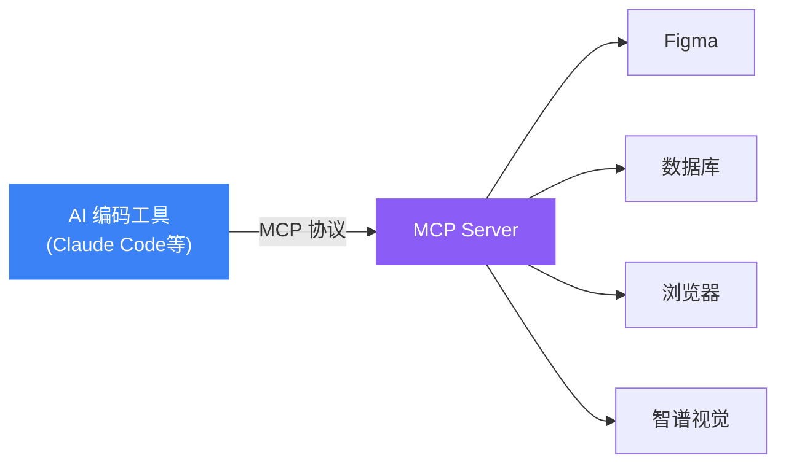
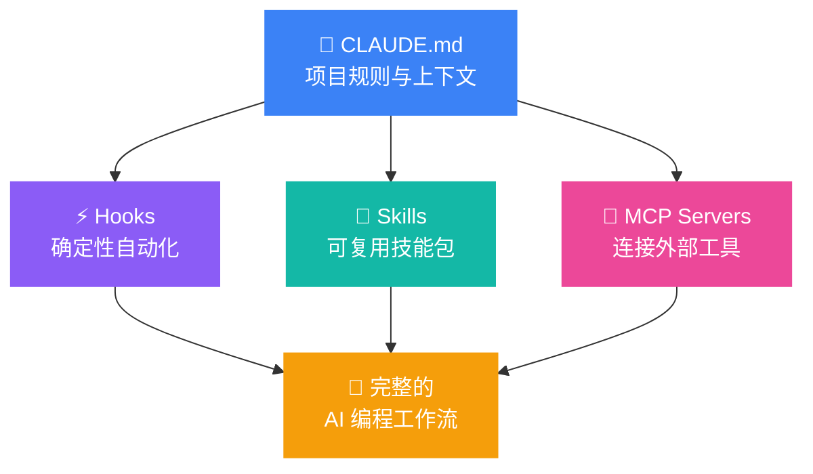

# Part 3

Claude Code 使用技巧

---

# Claude Code 是什么？

<div class="grid grid-cols-2 gap-8 mt-6">

<div>

### 定位

<div class="mt-4 space-y-4">
<div v-click class="p-3 rounded bg-orange-500/10 border border-orange-500/20">
<div class="font-bold text-orange-400 mb-1">终端里的 AI 编程助手</div>
<div class="text-sm opacity-70">直接在项目目录中运行，理解完整项目上下文</div>
</div>

<div v-click class="p-3 rounded bg-orange-500/10 border border-orange-500/20">
<div class="font-bold text-orange-400 mb-1">Agentic Loop</div>
<div class="text-sm opacity-70">收集上下文 → 执行操作 → 验证结果 → 自动迭代</div>
</div>

<div v-click class="p-3 rounded bg-orange-500/10 border border-orange-500/20">
<div class="font-bold text-orange-400 mb-1">不只是对话 — 自主行动</div>
<div class="text-sm opacity-70">读写文件、运行命令、Git 操作、创建 PR、执行测试</div>
</div>
</div>

</div>

<div>

### 安装与启动

```bash
# 安装
npm install -g @anthropic-ai/claude-code

# 在项目目录中启动
cd your-project
claude

# 常用启动参数
claude --model sonnet       # 指定模型
claude --continue            # 继续上次对话
claude --resume              # 恢复历史会话
```

<div v-click class="mt-4 p-3 rounded bg-gray-500/5 text-sm opacity-70">
<strong>计费：</strong>使用 Anthropic API 额度，Sonnet 性价比最高；也可通过 Claude Max 订阅使用
</div>

</div>

</div>

---

# 核心配置：CLAUDE.md

<div class="mt-6">

### CLAUDE.md — 项目的"说明书"

<div class="grid grid-cols-2 gap-6 mt-4">

<div>

```markdown
# CLAUDE.md

## 项目概述
基于 Vue 3 + TypeScript 的后台管理系统

## 技术栈
- 框架：Vue 3 + Composition API
- 状态管理：Pinia
- 样式：UnoCSS

## 常用命令
pnpm dev      # 启动开发服务器
pnpm build    # 构建
pnpm test     # 运行测试

## 代码规范
- 使用 Composition API + <script setup>
- 组件使用 PascalCase 命名
- 提交信息使用中文
```

</div>

<div v-click class="space-y-4">

<div class="p-3 rounded bg-blue-500/10 border border-blue-500/20">
<div class="font-bold text-blue-400">CLAUDE.md 放哪里？</div>
<div class="text-sm opacity-70 mt-1">
<div>📁 项目根目录 — 对所有人生效</div>
<div>📁 <code>~/.claude/CLAUDE.md</code> — 个人全局配置</div>
</div>
</div>

<div class="p-3 rounded bg-green-500/10 border border-green-500/20">
<div class="font-bold text-green-400">最佳实践</div>
<ul class="text-sm opacity-70 mt-1 space-y-1">
<li>控制在 60 行以内，简洁明了</li>
<li>写清楚项目架构和常用命令</li>
<li>标注代码规范和约定</li>
<li>不用写显而易见的规则</li>
</ul>
</div>

</div>

</div>

</div>

---

# 高级功能：Hooks

<div class="mt-6">

### Hooks — 在特定事件时自动执行脚本

<div class="grid grid-cols-2 gap-6 mt-4">

<div>

```json
// .claude/settings.json
{
  "hooks": {
    "PostToolUse": [{
      "matcher": "Write|Edit",
      "command": "npx prettier --write $FILE_PATH"
    }],
    "PreCommit": [{
      "command": "pnpm lint && pnpm test"
    }],
    "Notification": [{
      "command": "terminal-notifier -title 'Claude Code' -message '$MESSAGE'"
    }]
  }
}
```

</div>

<div v-click class="space-y-4">

<div class="p-3 rounded bg-purple-500/10 border border-purple-500/20">
<div class="font-bold text-purple-400 mb-1">常用场景</div>
<ul class="text-sm opacity-70 space-y-1">
<li>编辑文件后自动格式化</li>
<li>提交前自动跑 lint 和测试</li>
<li>任务完成后发送桌面通知</li>
<li>阻止某些危险操作</li>
</ul>
</div>

<div class="p-3 rounded bg-amber-500/10 border border-amber-500/20">
<div class="font-bold text-amber-400 mb-1">支持的事件</div>
<div class="text-sm opacity-70">
<code>PreToolUse</code> · <code>PostToolUse</code> · <code>Notification</code> · <code>PreCommit</code> · <code>UserPromptSubmit</code>
</div>
</div>

</div>

</div>

</div>

---

# 高级功能：Skills

<div class="mt-6">

### Skills — 可复用的技能包

<div class="grid grid-cols-2 gap-6 mt-4">

<div>

**目录结构：**

```
.claude/skills/
  └── my-skill/
      ├── SKILL.md        # 技能定义（必须）
      ├── templates/      # 模板文件（可选）
      └── references/     # 参考文档（可选）
```

**SKILL.md 格式：**

```markdown
---
name: my-skill
description: 描述这个技能做什么
triggers:
  - "关键词1"
  - "关键词2"
---

# 指令内容

具体的使用步骤和规则...
```

</div>

<div v-click class="space-y-4">

<div class="p-3 rounded bg-teal-500/10 border border-teal-500/20">
<div class="font-bold text-teal-400 mb-1">Skills 的优势</div>
<ul class="text-sm opacity-70 space-y-1">
<li>可跨项目复用</li>
<li>支持自动触发（按关键词匹配）</li>
<li>可打包为插件分享给团队</li>
<li>社区有大量现成 Skills 可安装</li>
</ul>
</div>

<div class="p-3 rounded bg-gray-500/5 text-sm">
<strong>示例：</strong>Slidev 技能（本项目中已有）— 自动识别 .md 文件，提供 Slidev 语法参考
</div>

</div>

</div>

</div>

---

# 实用 Prompt 技巧

<div class="mt-6 grid grid-cols-2 gap-6">

<div>

### 好的 Prompt 长什么样

<div v-click class="p-3 rounded bg-green-500/10 border border-green-500/20 mb-3">
<div class="font-bold text-green-400 mb-1">✅ 具体 + 有上下文</div>
<div class="text-xs opacity-70 font-mono mt-1">
"在 src/components/UserTable.vue 中，添加一个搜索框，支持按姓名和邮箱筛选，使用防抖 300ms"
</div>
</div>

<div v-click class="p-3 rounded bg-red-500/10 border border-red-500/20 mb-3">
<div class="font-bold text-red-400 mb-1">❌ 模糊 + 无上下文</div>
<div class="text-xs opacity-70 font-mono mt-1">
"帮我加个搜索功能"
</div>
</div>

<div v-click class="p-3 rounded bg-green-500/10 border border-green-500/20">
<div class="font-bold text-green-400 mb-1">✅ 分步 + 要求验证</div>
<div class="text-xs opacity-70 font-mono mt-1">
"1. 分析现有的错误处理模式<br>
2. 统一为 try-catch + toast 提示<br>
3. 运行 pnpm build 确认无类型错误"
</div>
</div>

</div>

<div>

### 提效技巧

<div v-click class="p-3 rounded bg-blue-500/10 border border-blue-500/20 mb-3">
<div class="font-bold text-blue-400">/init — 初始化项目理解</div>
<div class="text-sm opacity-70">自动分析项目结构，生成 CLAUDE.md</div>
</div>

<div v-click class="p-3 rounded bg-blue-500/10 border border-blue-500/20 mb-3">
<div class="font-bold text-blue-400">Plan Mode — 先规划再动手</div>
<div class="text-sm opacity-70">复杂任务先让 Claude 规划方案，确认后再执行</div>
</div>

<div v-click class="p-3 rounded bg-blue-500/10 border border-blue-500/20 mb-3">
<div class="font-bold text-blue-400">Shift+Tab — 切换模型</div>
<div class="text-sm opacity-70">快速在 Sonnet（快）和 Opus（强）间切换</div>
</div>

<div v-click class="p-3 rounded bg-blue-500/10 border border-blue-500/20">
<div class="font-bold text-blue-400">让 Claude 先问你</div>
<div class="text-sm opacity-70">模糊需求时说"先问我需要什么信息再开始"</div>
</div>

</div>

</div>

---

# 自定义命令（Slash Commands）

<div class="mt-6">

### 用 Markdown 文件创建团队专属命令

<div class="grid grid-cols-2 gap-6 mt-4">

<div>

**目录结构：**

```
.claude/commands/         # 项目级命令（团队共享）
├── review.md             # /review (project)
├── test.md               # /test (project)
└── ci/
    ├── build.md          # /ci:build (project:ci)
    └── lint.md           # /ci:lint (project:ci)

~/.claude/commands/       # 个人级命令（全局可用）
├── daily.md              # /daily (user)
└── commit.md             # /commit (user)
```

**命令文件格式（review.md）：**

```markdown
---
description: Code review 当前变更
allowed-tools: Read, Bash(git:*)
---

请 review 当前 git diff 的所有变更，
重点关注：$ARGUMENTS

检查项：
1. 代码逻辑正确性
2. 潜在安全风险
3. 性能问题
```

</div>

<div v-click class="space-y-4">

<div class="p-3 rounded bg-indigo-500/10 border border-indigo-500/20">
<div class="font-bold text-indigo-400 mb-1">命令中的特殊语法</div>
<ul class="text-sm opacity-70 space-y-1">
<li><code>$ARGUMENTS</code> — 引用用户输入的参数</li>
<li><code>@path/to/file</code> — 引用项目文件</li>
<li><code>!`command`</code> — 嵌入 bash 命令输出</li>
</ul>
</div>

<div class="p-3 rounded bg-green-500/10 border border-green-500/20">
<div class="font-bold text-green-400 mb-1">使用方式</div>
<div class="text-sm opacity-70">
在 Claude Code 中直接输入命令名即可调用：
<br><code>/review</code> · <code>/test</code> · <code>/ci:build</code>
<br>支持传参：<code>/review 安全性和性能</code>
</div>
</div>

<div class="p-3 rounded bg-amber-500/10 border border-amber-500/20">
<div class="font-bold text-amber-400 mb-1">适用场景</div>
<ul class="text-sm opacity-70 space-y-1">
<li>团队统一的 Code Review 流程</li>
<li>标准化的提交信息生成</li>
<li>项目特定的构建/部署检查</li>
<li>常用的分析/重构任务</li>
</ul>
</div>

</div>

</div>

</div>

---

# MCP — 让 AI 连接一切工具

<div class="mt-6">

### Model Context Protocol（模型上下文协议）

<div class="grid grid-cols-2 gap-6 mt-4">

<div>

**MCP 是什么？**

<div v-click class="p-3 rounded bg-blue-500/10 border border-blue-500/20 mb-4">
<div class="font-bold text-blue-400 mb-1">AI 的 USB-C 接口</div>
<div class="text-sm opacity-70">
Anthropic 于 2024.11 推出的开放协议，标准化 AI 模型与外部工具/数据源之间的通信方式。一个协议连接所有服务，无需为每个工具单独写接口
</div>
</div>

**工作原理：**



</div>

<div v-click class="space-y-4">

<div class="p-3 rounded bg-green-500/10 border border-green-500/20">
<div class="font-bold text-green-400 mb-1">核心能力</div>
<ul class="text-sm opacity-70 space-y-1">
<li><strong>Tools</strong> — 调用外部工具（查询数据库、操作文件）</li>
<li><strong>Resources</strong> — 读取外部数据（API、文档、代码）</li>
<li><strong>Prompts</strong> — 预定义的提示词模板</li>
</ul>
</div>

<div class="p-3 rounded bg-purple-500/10 border border-purple-500/20">
<div class="font-bold text-purple-400 mb-1">为什么重要？</div>
<ul class="text-sm opacity-70 space-y-1">
<li>AI 编码工具从"只能读写代码"进化到"能操作一切"</li>
<li>社区已有数千个 MCP Server 可直接使用</li>
<li>Claude Code、Cursor、Windsurf、OpenCode 均已支持</li>
</ul>
</div>

</div>

</div>

</div>

---

# MCP 实战案例

<div class="mt-6">

### 两个代表性 MCP Server

<div class="grid grid-cols-2 gap-6 mt-4">

<div>

**Figma MCP — 设计稿直接生成代码**

<div class="mt-3 space-y-3">
<div class="p-3 rounded bg-blue-500/10 border border-blue-500/20">
<div class="font-bold text-blue-400 mb-1">核心功能</div>
<ul class="text-sm opacity-70 space-y-1">
<li><code>get_figma_data</code> — 读取设计稿的布局、样式、组件</li>
<li><code>download_figma_images</code> — 下载设计稿中的图片/图标资源</li>
<li>自动提取 Design Token（颜色、字号、间距）</li>
</ul>
</div>

<div class="p-3 rounded bg-blue-500/5 text-sm">
<strong>工作流：</strong>粘贴 Figma 链接 → Claude 读取设计结构 → 生成像素级精确的前端代码
</div>

```json
// .claude/settings.json 配置
{
  "mcpServers": {
    "figma": {
      "command": "npx",
      "args": ["-y", "figma-developer-mcp"]
    }
  }
}
```

</div>

</div>

<div>

**智谱视觉 MCP — 给 AI 装上"眼睛"**

<div class="mt-3 space-y-3">
<div class="p-3 rounded bg-cyan-500/10 border border-cyan-500/20">
<div class="font-bold text-cyan-400 mb-1">核心功能</div>
<ul class="text-sm opacity-70 space-y-1">
<li><code>image_analysis</code> — 通用图像理解（截图、设计稿）</li>
<li><strong>UI Diff</strong> — 对比两张 UI 截图，识别视觉差异</li>
<li><strong>UI 还原</strong> — 从截图直接生成前端代码</li>
<li>视频关键帧提取与理解</li>
</ul>
</div>

<div class="p-3 rounded bg-cyan-500/5 text-sm">
<strong>工作流：</strong>截图/设计稿 → 视觉分析 → 生成代码 → UI Diff 对比验证
</div>

```json
// .claude/settings.json 配置
{
  "mcpServers": {
    "zhipu-vision": {
      "command": "npx",
      "args": ["-y", "@anthropic-ai/vision-mcp-server"],
      "env": {
        "ZHIPU_API_KEY": "your-key"
      }
    }
  }
}
```

</div>

</div>

</div>

<div v-click class="mt-4 p-3 rounded bg-yellow-500/10 border border-yellow-500/20 text-sm">
💡 <strong>设计到代码的完整闭环：</strong>Figma MCP（读设计稿）+ 智谱视觉 MCP（截图对比验证）= AI 完成从设计到代码再到质量验收的全流程
</div>

</div>

---

# 四层配置体系

<div class="mt-8 text-center">



</div>

<div class="mt-4 text-sm opacity-70 text-center">
<strong>进阶路径：</strong>CLAUDE.md（基础配置）→ Hooks（自动化）→ Skills（技能复用）→ MCP（连接外部工具）→ 组合形成完整工作流
</div>
