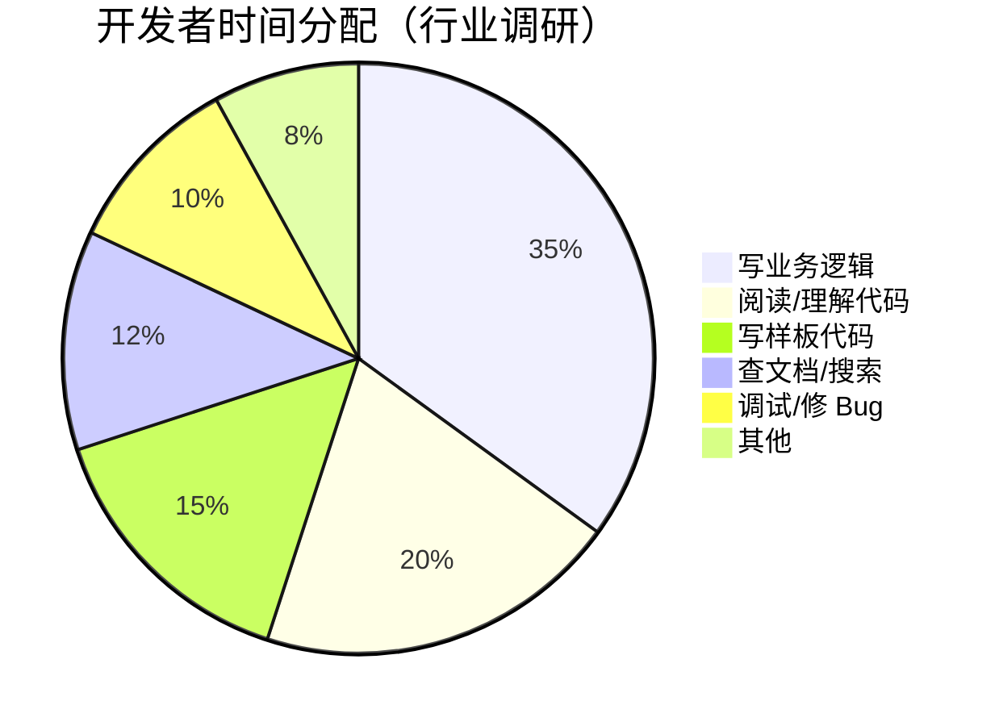

---
---

# 开发者的日常

### 时间都去哪了？

 

低价值重复劳动

<ul class="text-xs opacity-80">
<li>CRUD、表单验证、类型定义</li>
<li>重复的组件模板和样式</li>
<li>API 对接的样板代码</li>
</ul>

上下文切换成本

<ul class="text-xs opacity-80">
<li>频繁在 IDE 和浏览器间切换查文档</li>
<li>Stack Overflow 来回翻找答案</li>
<li>在多个文件间跳转理解逻辑</li>
</ul>

知识壁垒

<ul class="text-xs opacity-80">
<li>不熟悉的框架/API 上手慢</li>
<li>遗留代码理解困难</li>
<li>跨领域开发（前端↔后端）效率低</li>
</ul>

---

# 这些场景，你是否熟悉？

🤔

"这个 API 参数是什么意思来着？"

打开浏览器 → 搜索 → 翻文档 → 切回 IDE → 忘了再看一遍

😫

"又一个 CRUD 页面，几乎一样的逻辑"

复制粘贴上一个页面 → 逐个修改变量名和字段 → 手动调整差异

😤

"这段遗留代码谁写的？想改但怕改出问题"

花大量时间理解上下文 → 小心翼翼修改 → 反复验证没有副作用

😴

"测试？时间紧先不写了（技术债 +1）"

手动测试通过就上线 → 后续改动缺少回归保障 → Bug 率上升

---
layout: center
class: text-center
---

# 如果 AI 能帮你处理这些重复劳动呢？

  让开发者专注在真正需要思考的工作上

  接下来，我们看看当前国内外模型的现状

