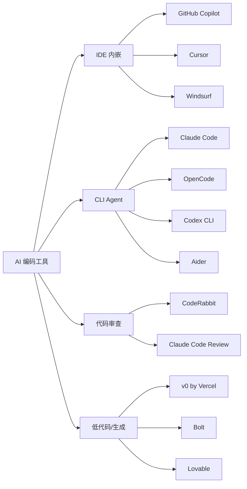

# Part 2

AI 编码工具对比

---

# AI 编码工具分类

<div class="mt-8">



</div>

<div v-click class="mt-4 p-3 rounded bg-gray-500/5 text-sm opacity-70">
<strong>核心趋势：</strong>工具从"代码补全"进化到"自主 Agent" — 不只是建议代码，而是能理解需求、读写文件、执行命令、自动调试
</div>

---

# IDE 内嵌工具：Cursor vs Copilot vs Windsurf

<div class="grid grid-cols-3 gap-4 mt-6">

<div v-click class="p-4 rounded-lg border border-blue-500/30 bg-blue-500/5">
<div class="flex items-center gap-2 mb-3">
<span class="text-xl">🔵</span>
<span class="font-bold">Cursor</span>
</div>
<div class="text-sm space-y-1">
<div><span class="opacity-50">模式：</span>Tab 补全 + Agent 模式</div>
<div><span class="opacity-50">模型：</span>Claude / GPT / 自选</div>
<div><span class="opacity-50">亮点：</span>多文件编辑、自动执行终端命令、错误自修复</div>
<div class="mt-2 text-xs opacity-50">价格：$20/月 Pro</div>
</div>
</div>

<div v-click class="p-4 rounded-lg border border-green-500/30 bg-green-500/5">
<div class="flex items-center gap-2 mb-3">
<span class="text-xl">🟢</span>
<span class="font-bold">GitHub Copilot</span>
</div>
<div class="text-sm space-y-1">
<div><span class="opacity-50">模式：</span>行内补全 + Chat</div>
<div><span class="opacity-50">模型：</span>GPT-4o / o3 / Claude</div>
<div><span class="opacity-50">亮点：</span>VS Code/JetBrains 原生集成，生态最广，免费版可用</div>
<div class="mt-2 text-xs opacity-50">价格：免费 / $10/月 / $19/月</div>
</div>
</div>

<div v-click class="p-4 rounded-lg border border-purple-500/30 bg-purple-500/5">
<div class="flex items-center gap-2 mb-3">
<span class="text-xl">🟣</span>
<span class="font-bold">Windsurf</span>
</div>
<div class="text-sm space-y-1">
<div><span class="opacity-50">模式：</span>Cascade 自动流</div>
<div><span class="opacity-50">模型：</span>Claude / GPT / 自选</div>
<div><span class="opacity-50">亮点：</span>多文件自动编辑 + 终端执行，价格有优势</div>
<div class="mt-2 text-xs opacity-50">价格：免费 / $15/月 Pro</div>
</div>
</div>

</div>

<div v-click class="mt-4 p-3 rounded bg-blue-500/10 border border-blue-500/20 text-sm">
💡 <strong>选型参考：</strong>日常编码补全 → <strong>Copilot</strong>（轻量免费）；深度重构 + Agent 任务 → <strong>Cursor</strong>（最成熟）；性价比 → <strong>Windsurf</strong>
</div>

---

# CLI Agent 工具：Claude Code vs OpenCode

<div class="grid grid-cols-2 gap-6 mt-6">

<div>

### Claude Code

<div class="space-y-3 mt-2">
<div v-click class="p-3 rounded bg-orange-500/10 border border-orange-500/20">
<div class="font-bold text-orange-400 mb-1">终端里的 AI 结对编程</div>
<div class="text-sm opacity-70">直接在命令行中运行，理解整个项目上下文</div>
</div>

<div v-click class="p-3 rounded bg-orange-500/10 border border-orange-500/20">
<div class="font-bold text-orange-400 mb-1">自主执行 + 完整工作流</div>
<div class="text-sm opacity-70">读写文件、执行命令、Git 操作、Code Review</div>
</div>

<div v-click class="p-3 rounded bg-orange-500/10 border border-orange-500/20">
<div class="font-bold text-orange-400 mb-1">模型支持</div>
<div class="text-sm opacity-70">原生 Anthropic Claude 系列；通过 CC Switch 可接入 DeepSeek / GLM / MiniMax 等第三方模型</div>
</div>
</div>

```bash
# 典型用法
claude "添加用户登录页面，含表单验证"
claude "运行测试并修复所有失败用例"
claude "review 这个 PR 并给出建议"
```

</div>

<div>

### OpenCode

<div class="space-y-3 mt-2">
<div v-click class="p-3 rounded bg-teal-500/10 border border-teal-500/20">
<div class="font-bold text-teal-400 mb-1">开源 AI 编程 Agent</div>
<div class="text-sm opacity-70">Go 编写，TUI 界面，支持终端/桌面/IDE 多端</div>
</div>

<div v-click class="p-3 rounded bg-teal-500/10 border border-teal-500/20">
<div class="font-bold text-teal-400 mb-1">模型自由切换</div>
<div class="text-sm opacity-70">支持 Claude / GPT / Gemini / DeepSeek 等任意模型，含免费额度</div>
</div>

<div v-click class="p-3 rounded bg-teal-500/10 border border-teal-500/20">
<div class="font-bold text-teal-400 mb-1">LSP 深度集成</div>
<div class="text-sm opacity-70">兼容 Tmux/SSH，可在远程服务器甚至手机端使用</div>
</div>
</div>

```bash
# 典型用法
opencode "重构这个模块的错误处理"
opencode "为这个函数编写单元测试"
opencode "分析项目架构"
```

</div>

</div>

<div v-click class="mt-4 p-3 rounded bg-gray-500/5 text-sm opacity-70">
<strong>对比：</strong>Claude Code 编码能力最强，原生绑定 Claude 但可通过 CC Switch 接入第三方模型；OpenCode 开源免费、模型可选、LSP 集成深，是国产模型用户的理想选择
</div>

---

# 工具能力对比

<div class="mt-6 text-sm">

| 能力 | Cursor | Copilot | Windsurf | Claude Code | OpenCode |
|------|:------:|:-------:|:--------:|:-----------:|:--------:|
| 代码补全 | ⭐⭐⭐⭐⭐ | ⭐⭐⭐⭐⭐ | ⭐⭐⭐⭐ | — | — |
| 对话式编码 | ⭐⭐⭐⭐⭐ | ⭐⭐⭐⭐ | ⭐⭐⭐⭐ | ⭐⭐⭐⭐⭐ | ⭐⭐⭐⭐⭐ |
| 多文件编辑 | ⭐⭐⭐⭐⭐ | ⭐⭐⭐ | ⭐⭐⭐⭐⭐ | ⭐⭐⭐⭐⭐ | ⭐⭐⭐⭐ |
| 执行终端命令 | ⭐⭐⭐⭐ | ⭐⭐ | ⭐⭐⭐⭐ | ⭐⭐⭐⭐⭐ | ⭐⭐⭐⭐ |
| 自动修复错误 | ⭐⭐⭐⭐ | ⭐⭐⭐ | ⭐⭐⭐⭐ | ⭐⭐⭐⭐⭐ | ⭐⭐⭐⭐ |
| Git/PR 操作 | ⭐⭐⭐ | ⭐⭐ | ⭐⭐⭐ | ⭐⭐⭐⭐⭐ | ⭐⭐⭐⭐ |
| 项目级理解 | ⭐⭐⭐⭐ | ⭐⭐⭐ | ⭐⭐⭐⭐ | ⭐⭐⭐⭐⭐ | ⭐⭐⭐⭐ |
| 模型自由度 | ⭐⭐⭐⭐ | ⭐⭐⭐ | ⭐⭐⭐⭐ | ⭐⭐⭐（+CC Switch） | ⭐⭐⭐⭐⭐ |
| 开源 | ❌ | ❌ | ❌ | ❌ | ✅ |
| 上手难度 | 低 | 低 | 低 | 中 | 低 |

</div>

<div v-click class="mt-6 p-3 rounded bg-yellow-500/10 border border-yellow-500/20 text-sm">
💡 <strong>关键发现：</strong>IDE 工具（Cursor/Copilot）适合日常编码辅助；CLI Agent（Claude Code/OpenCode）适合复杂多步骤任务；OpenCode 开源免费 + 模型可选，特别适合搭配国产模型使用
</div>

---

# 团队落地建议

<div class="mt-6 grid grid-cols-2 gap-6">

<div>

### 推荐工具组合

<div v-click class="p-3 rounded bg-blue-500/10 border border-blue-500/20 mb-4">
<div class="font-bold text-blue-400">日常编码</div>
<div class="text-sm opacity-70">Cursor（主力IDE）或 Copilot（VS Code 插件）— 行内补全 + 对话</div>
</div>

<div v-click class="p-3 rounded bg-green-500/10 border border-green-500/20 mb-4">
<div class="font-bold text-green-400">复杂任务</div>
<div class="text-sm opacity-70">Claude Code（编码最强）或 OpenCode（开源免费 + 国产模型）— 重构、Bug 修复、项目分析</div>
</div>

<div v-click class="p-3 rounded bg-purple-500/10 border border-purple-500/20">
<div class="font-bold text-purple-400">代码审查</div>
<div class="text-sm opacity-70">Claude Code Review / CodeRabbit — 自动 PR Review</div>
</div>

</div>

<div>

### 效率提升路径

<div v-click class="mb-3">
<div class="font-bold">Phase 1 — 体验期（1-2 周）</div>
<div class="text-sm opacity-70">安装 Cursor，用 Tab 补全和 Chat 日常编码</div>
</div>

<div v-click class="mb-3">
<div class="font-bold">Phase 2 — 进阶期（2-4 周）</div>
<div class="text-sm opacity-70">学习 Prompt 技巧，使用 Agent 模式处理复杂需求</div>
</div>

<div v-click class="mb-3">
<div class="font-bold">Phase 3 — 深度期（1-2 月）</div>
<div class="text-sm opacity-70">引入 Claude Code，建立团队 CLAUDE.md 统一上下文</div>
</div>

<div v-click class="mb-3">
<div class="font-bold">Phase 4 — 规模化</div>
<div class="text-sm opacity-70">自动化 PR Review、CI 集成、效率数据度量</div>
</div>

</div>

</div>
